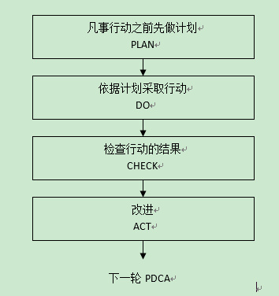
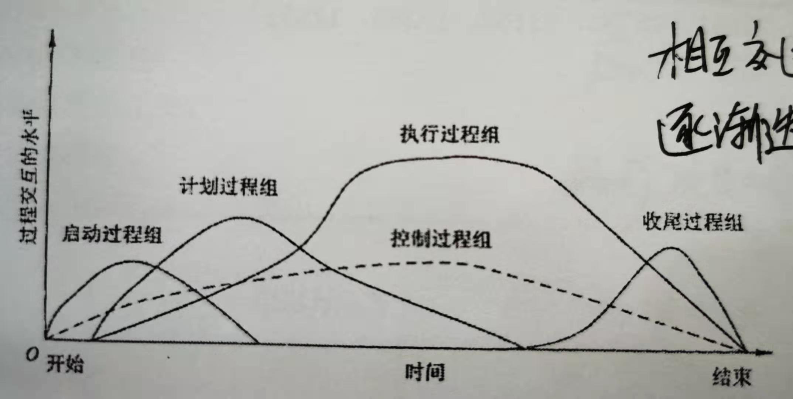

## 一、项目管理的基本知识

一、**项目的定义**：

    项目是为提供一项独特产品、服务或成果所做的临时性努力。

二、**以下活动都是项目**：

    开发新产品或服务，如一款新手机；
    改变企业治理结构或其他组织结构、人员配备或作风，实施全新的经营流程；
    开发或购买新的信息系统；
    向火星发射探测器；
    在互联网上建立电子商务网站；
    影视创作等等。

三、**项目的特点**：

    临时性；
    独特的产品、服务或成果；
    逐步完善；
    资源约束；
    目的性；
    临时性：每一个项目都有一个明确的开始时间和结束时间，项目是一次性的。
    独特性：项目创造的可交付成果，是独特的。
    渐进性：项目是逐步完善的过程，是分步、连续的积累，如需求的完善。

四、**项目目标**：

项目目标是指实施项目所要达到的期望结果，即项目所能交付的成果或服务。项目可以有一个目标，也可以有多个目标。项目目标要量化，定义清晰的项目目标将最有利于提供定义项目成功与否的标准。 它包括成果性目标和约束性目标。项目的三个基本目标是时间、成本、质量标准。

五、**项目目标的特性**：

    不同的优先级、层次性、多目标性。

六、**项目与日常运作的区别**

| 不同点   | 项目         | 日常运作       |
| -------- | ------------ | -------------- |
| 目的     | 独特的       | 常规的，普通的 |
| 责任人   | 项目经理     | 部门经理       |
| 持续时间 | 有限的       | 相对无限的     |
| 持续性   | 一次性       | 重复性         |
| 组织结构 | 项目组织     | 职能部门       |
| 考核指标 | 以目标为导向 | 效率和有效性   |
| 资源需求 | 多变性       | 稳定性         |

七、**项目与战略**

    项目经常当做实现组织战略计划的一种手段。
    战略考虑是项目批准的依据。

八、**项目被批准的典型战略考虑（依据）**：

    市场需求
    运营需要
    客户要求
    技术进步
    法律要求

九、**典型的信息系统项目特点**：

    项目初期目标往往不太明确。
    需求变化频繁。 
    智力密集型。
    系统分析和设计所需成员层次高，专业化强。
    涉及的软硬件厂商和承包商多，联系、协调复杂。
    软件和硬件常常需要个性化定制。
    项目生命周期通常较短。
    通常要采用大量的新技术。
    使用与维护的要求高。
    项目绩效往往难以评估和量化。

十、**项目管理的定义**：

把各种知识、技能、手段和技术应用于项目活动之中，以达到项目的要求。项目管理方法的核心是目标管理风险管理相结合。

十一、**项目管理的理解**：

1. 项目管理师一种管理方法体系、管理模式，而不是任意的一次管理过程。
2. 项目管理的对象、目的。项目管理的对象是项目，即一系列的临时任务。
3. 项目管理的任务、职能。项目管理的职能与其他管理的职能是完全一致的，即是对组织的资源进行计划、组织、指挥、协调、控制。
4. 项目管理运用系统理论与思想。
5. 项目管理职能主要是由项目经理执行的。

十二、**项目管理的特点**：

1. 项目管理是一项复杂的工作。
2. 项目管理具有创造性。
3. 项目管理需要集权领导和建立专门的项目组织。
4. 项目经理在项目管理中起着非常重要的作用。
5. 社会经济、政治、文化、自然环境等对项目的影响。
   1. 文化与社会环境：理解项目影响或对其有利害关系的人群的经济、人口、教育、道德、种族、宗教状况，以及其他特征。
   2. 国际与政治环境：熟悉相应的国际、国家、地区和当地的法律和习惯，以及可能影响本项目的政治气候。举行面对面会议时的时区差别、国家与地区节假日、旅行出差要求与电话会议的后勤保证问题。
   3. 自然环境

## 二、项目管理知识体系

​	项目管理知识体系

1. **5个知识领域**

   - 项目管理知识体系。
   - 应用领域的知识、标准和规定。
   - 项目环境知识。
   - 通用的管理知识和技能。
   - 软技能或人际关系技能。

2. **一般的管理知识和技能**：

   - 财务管理和会计。
   - 购买和采购。
   - 销售和营销。
   - 合同和商业法律。
   - 制造和分配。
   - 后勤和供应链。
   - 战略计划、战术计划和运作计划。
   - 组织结构、组织行为、人事管理、薪资、福利和职业规划。
   - 健康和安全管理。

3. **软技能**：

   - 有效的沟通：信息交流。
   - 影响一个组织：“让事情办成”的能力。
   - 领导能力：形成一个前景和战略并组织人员达到它。
   - 激励：激励人员达到高水平的生产率并克服变革的阻力。
   - 谈判和冲突管理：与其他人谈判或达成协议。
   - 问题解决：问题定义和做出决策的结合。

4. **IPMP/PMP**

   - **IPMA**:国际项目管理协会
     - IPMA将其知识体系划分为28个核心要素和14个附加要素。
   - IPMP：国际项目管理专业资质认证，是IPMA在全球推行的司机项目管理专业资质认证体系的总称。
     - IMPA依据国际项目管理专业资质标准，针对项目管理人员专业水平的不同将项目管理专业人员资质认证划分为四个等级，即A级、B级、C级、D级。
       - A级证书是认证的高级项目经理（CPD）。
       - B级证书是认证的项目经理（CPM）。
       - C级证书是认证的项目管理专家（PMP）。
       - D级证书是认证的项目管理专业人员（PMF）。
       - PMI：美国项目管理协会。
       - PMBOK：项目管理的知识体系。
       - PMP：项目管理专业人员资格认证，有效期为3年。

5. PRINCE2：（项目管理王者认证），一种基于流程的结构化项目管理方法。

   PMNOK提供了全面的项目管理知识体系，而PRINCE2提供最佳的项目管理方法论，更加接近项目的实施，更加重视项目的实际收益和回报。

   PRINCE2包括原则、流程、主题以及项目环境四个要素。

   PRINCE2原则：持续业务验证、吸取经验教训、明确定义的角色和职责、按阶段管理、里外管理、关注产品、根据项目环境裁剪。

   PRINCE2主题：商业论证、组织、质量、计划、风险、变更、进展。

   PRINCE2流程：

   1. 项目准备流程。
   2. 项目指导流程。
   3. 项目启动流程。
   4. 阶段控制流程。
   5. 阶段边界管理。
   6. 产品交付管理流程。
   7. 产品收尾流程。

6. 过程的定义：过程就是一组为了完成一系列事先指定的产品、成果或服务而需执行的互相联系的行动和活动。

   47个过程。5个过程组：启动、计划、执行、监督与控制、收尾。10大知识领域

7. PDCA循环（戴明环）

   PLAN --> DO --> CHECK --> ACT

   计划 --> 行动 --> 检查 --> 改进
   
   
   
8. **项目管理过程组**

   - **启动过程组**：定义并批准项目或阶段。比如正式批准项目进入下一阶段。

   - **计划过程组**：定义和细化目标，规划最佳的技术方案和管理计划，以实现项目火或阶段所承担的目标和范围。
   - **执行过程组**：整合人员和其他资源，在项目的生命周期或某个阶段执行项目管理计划，并得到输出与成果。
   - **监控过程组**：要求定期测量和监控进展、识别实际绩效与项目管理计划的偏差、必要时裁取纠正措施，或管理变更以确保项目或阶段目标达成。
   - **收尾过程组**：正式接受产品、服务或工作成果，有序地结束项目或阶段。

9. **启动过程组**（☆）

主要活动：

    1、制定项目章程；
    2、识别项目联系人；

项目章程的作用：

    任命项目经理，对项目经理进行授权；
    正式批准一个项目；
10. 计划过程组

    凡是制定项目管理计划所需的过程都属于计划过程组。

    项目管理计划不是一成不变的，它是渐进明细、逐步深入具体的，项目管理加护这种制定方法经常被成做“滚动波浪计划”方法，这意味着计划是一个反复和持续的过程。

    让有关项目干系人参与项目计划过程。

    在项目计划阶段，项目管理方法论帮助项目管理团队制定项目管理计划和控制项目管理计划的变更，例如组织过程资产中的历史项目信息，标准指导方针、模板、工作指南等对本次项目管理计划的制定有直接的帮助。    

11. 执行过程组

    整合人员和其他资源，在项目的生命周期或某个阶段执行项目管理计划。

12. 监督和控制过程组

    定期测量和监控项目绩效情况，识别与项目管理计划的偏差，以便在必要时采取纠正措施，确保项目或阶段目标达成。

13. 收尾过程组

    正式验收产品、服务或工作成果，有序的结束项目或项目阶段。

14. 过程的交互

    一个过程的结果或输出通常会成为另一个过程的输入或者成为整个项目的最终结果。

    项目过程组很少会使离散的或者只出现一次，他们是相互交迭的活动。

    

15. 项目管理过程组

|     知识领域     | 启动过程组     | 计划过程组                                                   | 执行过程组                                     | 监督和控制过程组                       | 收尾过程组     |
| :--------------: | -------------- | ------------------------------------------------------------ | ---------------------------------------------- | -------------------------------------- | -------------- |
|   项目整体管理   | 制定项目章程   | 指定项目管理计划                                             | 指导和管理项目执行                             | 监督和控制项目工作 实施整体变更控制 | 结束项目或阶段 |
|   项目范围管理   |                | 规划范围管理 手机需求 定义范围 创建工作分解结构   |                                                | 核实范围 控制范围                  |                |
|   项目进度管理   |                | 规划进度管理 定义活动 排列活动顺序 估算活动资源 估算活动历时 制定进度计划 |                                                | 控制进度                               |                |
|   项目成本管理   |                | 规划成本 估算成本 定制预算                           |                                                | 控制成本                               |                |
|   项目质量管理   |                | 规划质量                                                     | 实施质量保证                                   | 控制质量                               |                |
| 项目人力资源管理 |                | 制定人力资源计划                                             | 组建项目团队 建设项目团队 管理项目团队 |                                        |                |
|   项目沟通管理   |                | 规划沟通管理                                                 | 管理沟通                                       | 控制沟通                               |                |
|   项目风险管理   |                | 规划风险管理 识别风险 实施定性风险分析 实施定量风险分析 规划风险应对 |                                                | 控制风险                               |                |
|   项目采购管理   |                | 规划采购管理                                                 | 实施采购                                       | 控制采购                               | 结束采购       |
|  项目干系人管理  | 识别项目干系人 | 规划干系人管理                                               | 管理干系人参与                                 | 控制干系人参与                         |                |

**项目管理知识及知识体系完成。**