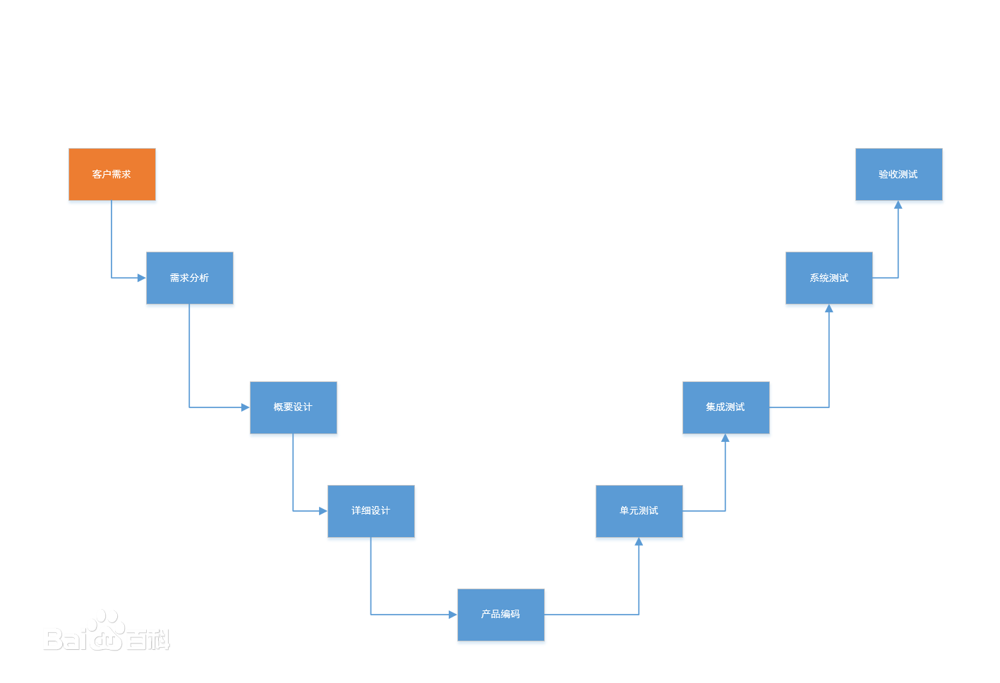

## 一、信息系统项目生命周期

### 一）、项目生命周期

项目阶段合在一起成为项目生命周期，项目生命周期定义了从项目开始直至结束的项目阶段，项目的每个阶段都至少包含管理工作和技术工作。

**所有项目都呈现下列通用的生命周期结构**：

- 启动项目。
- 组织与准备。
- 执行项目工作。
- 结束项目。	

### 二）、项目生命周期的特征

1. 在初始阶段，成本和人员投入水平较低，在中间阶段达到最高，当项目接近结束时则快速下降。

   

2. 在项目的初始阶段不确定性水平最高，因此达不到项目目标的风险是最高的。且随着项目的继续，完成项目的确定性通常也会逐渐上升。

3. 在项目的初始阶段，项目干系人对项目的影响最大，随着项目的继续开展则逐渐变低。

4. 在项目的初始阶段，变更成本较低。

   

   
### 三）、项目阶段

项目经理或组织可以把每一个项目划分成若干个阶段，以便有效地进行管理控制，并于实施该项目组织的日常运作联系起来。

在项目的一个阶段末，开始下一阶段之前，应该确保达到阶段的目标以及正式接受项目阶段成功。

### 四）、项目阶段的特征

1. 各阶段的工作重点不同，通常涉及不同的组织，处于不同的地理位置，需要不同的技能组合。
2. 为了成功实现各阶段的主要可交付成果或目标，需要对各阶段及其好活动进行独特的控制或采用独特的过程。
3. 阶段的结束以作为阶段性可交付成果的工作产品的转移或移交为标志。阶段结束点是重新评估项目活动。评审的目标是评审本阶段的任务是否已经完成，决定项目是否从当前阶段进入下一阶段。

### 五）、典型信息系统项目的生命周期模型

#### 1、瀑布模型

软件开发分为可行性分析（计划）、需求分析、软件设计（概要设计、详细设计）、编码（含单元测试）、测试、运营维护等几个阶段，比如需求分析阶段定义的规划将成为软件测试中的系统测试阶段的目标。

| 瀑布模型中每项开发活动具有的特点                             | 瀑布模型的适用范围                                           |
| ------------------------------------------------------------ | ------------------------------------------------------------ |
| （1）、从上一项开发活动接受其成果作为本次活动的输入。 （2）、利用这一输入，实施本次活动应完成的工作内容。 （3）、给出本次活动的工作成果，作为输出传给下一项开发活动。 （4）、对本次活动的实施工作成果进行评审。 | （1）、用户的需求非常清楚全面，且在开发工程中没有或很少有变化。 （2）、开发人员对软件的应用领域很熟悉。 （3）、用户的使用环境非常稳定。 （4）、开发工作对用户参与的要求很低。 （5）、二次开发或升级型的项目。  |

#### 2、V模型

V模型的重要意义在于，非常明确的表明了测试过程中存在的不同的级别，并且非常清晰的描述了这些测试阶段和开发阶段的对应关系。

V模型的左边下降的是开发过程各阶段，与此相对应的是右边上升的部分，即各测试过程的各个阶段。在不同的组织中对测试阶段的命名可能有所不同。

V模型的价值在于它非常明确地标明了测试过程中存在的不同级别，并且清楚地描述了这些测试阶段和开发各阶段的对应关系。

1. 单元测试的主要目的是针对编码过程中可能存在的各种错误，例如用户输入验证过程中的边界值的错误。
2. 集成测试主要目的是针对详细设计中可能存在的问题，尤其是检查各单元与其他程序部分之间的接口上可能存在的错误。
3. 系统测试主要针对概要设计，检查系统作为一个整体是否有效地得到运行，例如在产品设置中是否能达到预期的高性能。
4. 验收测试通常由业务专家或用户进行，以确认产品能真正符合用户业务上的需要。
   在不同的开发阶段，会出现不同类型的缺陷和错误，所以需要不同的测试技术和方法来发现这些缺陷。

**v模型的特点**：

- V模型提现的主要思想是开发和测试同等重要，左侧代表的是开发活动，而右侧代表的是测试活动。
- V模型针对每个开发阶段，都有一个测试级别与之相对应。
- 测试依旧是开发生命周期中的阶段，与瀑布模型不同的是，有多个测试级别与开发阶段相对应。
- V模型适用于需求明确和需求变更不频繁的情形。

#### 3、原型化模型

原型化模型的第一步是建造一个快速原型， 实现客户或未来的用户与系统的交互，经过和用户针对圆形的讨论和交流，弄清需求，以便真正把握用户需要的软件产品是什么样子的。充分了解后，再在原型基础上开发出用户满意的产品。

适用范围：需求复杂，需求难以确定、需求动态变化的软件系统。

#### 4、螺旋模型

螺旋模型是一个演化软件过程模型，将原型实现的迭代特征与线性顺序（瀑布）模型中控制和系统化的方面结合起来，使得软件的增量版本的快速开发成为可能。

显著特点：一是采用循环的方式，逐步加深系统定义和实现的深度，降低风险；二是确定一系列里程碑，确保项目开发过程中的相关利益者都支持可行的和令人满意的系统解决方案。

特点和适用范围： 强调了风险分析，特别适用于需求难以确定，大型而复杂、高风险的系统。 

螺旋模型每次迭代活动：制定计划、风险分析、实施工程和客户评估。

#### 5、迭代模型

在某种程度上，开发迭代是一次完整地经过所有工作流程的过程。

适用范围：需求难以确定，不断变更，多期开发的系统，比如计划多期开发的软件项目。

**RUP（统一软件开发过程）**

一种过程方法，迭代模型的一种具体实现。

RUP的软件生命周期划分为初始阶段、细化阶段、构建阶段、交付阶段。

初始阶段：系统地阐述项目的范围，选择可行的系统架构，计划和准备业务案例。

细化阶段：细化构想， 细化过程和基础设施，细化构架并选择构件，确保软件结构、需求、计划足够稳定；确保项目风险已经降到能够预计完成整个项目的成本和日常的程度。针对项目的软件结构上的主要风险已经解决或处理完成。

构造阶段：资源管理、控制和过程最优化，完成构建的开发并依据评价标准进行测试，依构想的验收标准评估产品的发布。

移交阶段：同步并使并发的构造增量集成到一致的实施基线中，与实施有关的工程活动（商业包装和生产、人员培训），根据完整的构想和需求集的验收标准评估实施基线。

#### 6、增量模型

融合了瀑布模型的基本成分（重复应用）和原型实现的迭代特征。

适用范围：对所开发的领域比较熟悉而且已有原型系统，进行已有产品升级或新版本开发。

#### 7、喷泉模型

以面向对象的软件开发方法为基础，以用户需求为导向，以对象来驱动的模型。主要用来描述面向对象的软件开发过程。

#### 8、敏捷方法

敏捷方法是一种以人为核心、迭代、循序渐进的开发方法，适用于一开始并没有或不能完整地确定出需求和范围的项目，或者需要应对快速变化的环境，或者需求和范围难以事先确定，或者能够以有利于干系人的方式定义较小的增量改进。在敏捷开发中，就是把一个大项目分成多个相互联系，但也可以独立运行的小项目。敏捷方法的目的在于应对大量变更，获取干系人的持续参与。

**敏捷开发的四个核心价值（敏捷宣言）**：

个体与交互过程高于过程和工具，

可用的软件高于完备的文档，

客户协作高于合同谈判，

响应变化高于遵循计划。

|   模型名称   |                           技术特点                           |                           适用范围                           |
| :----------: | :----------------------------------------------------------: | :----------------------------------------------------------: |
|   瀑布模型   | 简单，分阶段，阶段间存在因果关系， 各个阶段完成后都有评审，允许反馈,不支持用户参与，要求预先确定需求。 |            需求易于完善定义且不应变更的软件系统。            |
| 快速原型模型 | 不要求需求预先完备定义，支持用户参与， 支持需求的渐进式完善和确认，能够适应用户需求的变化。 |           需求复杂、难以确定、动态变化的软件系统。           |
|   增量模型   | 软件产品是被增量式地一块块开发的， 允许开发活动，病情和重叠。 |          技术风险较大，用户需求较为稳定的软件系统。          |
|   迭代模型   | 不要求一次性的开发出完整的软件系统，将软件开发视为一个逐步获取用户需求、完善软件产品的过程。 |              需求难以确定、不断变更的软件系统。              |
|   螺旋模型   | 结合瀑布模型、快速原型模型、和迭代模型的思想，并引进了风险分析活动。 |       需求难以获取和确定、软件开发风险较大的软件系统。       |
|     RUP      | 可改造、扩展和裁剪； 可以对它进行设计、开发、维护和发布； 强调迭代开发。 | 复杂和需求难以获取和确定的软件系统。 软件开发项目组拥有丰富的软件开发和管理经验。 |

#### 9、组织文化

组织文化常常会对项目产生直接的影响组织的沟通能力，对项目的执行方式有很大影响组织结构对能否获得项目所需资源和以何种条件获取资源起着制约作用。

## 二、项目组织结构

