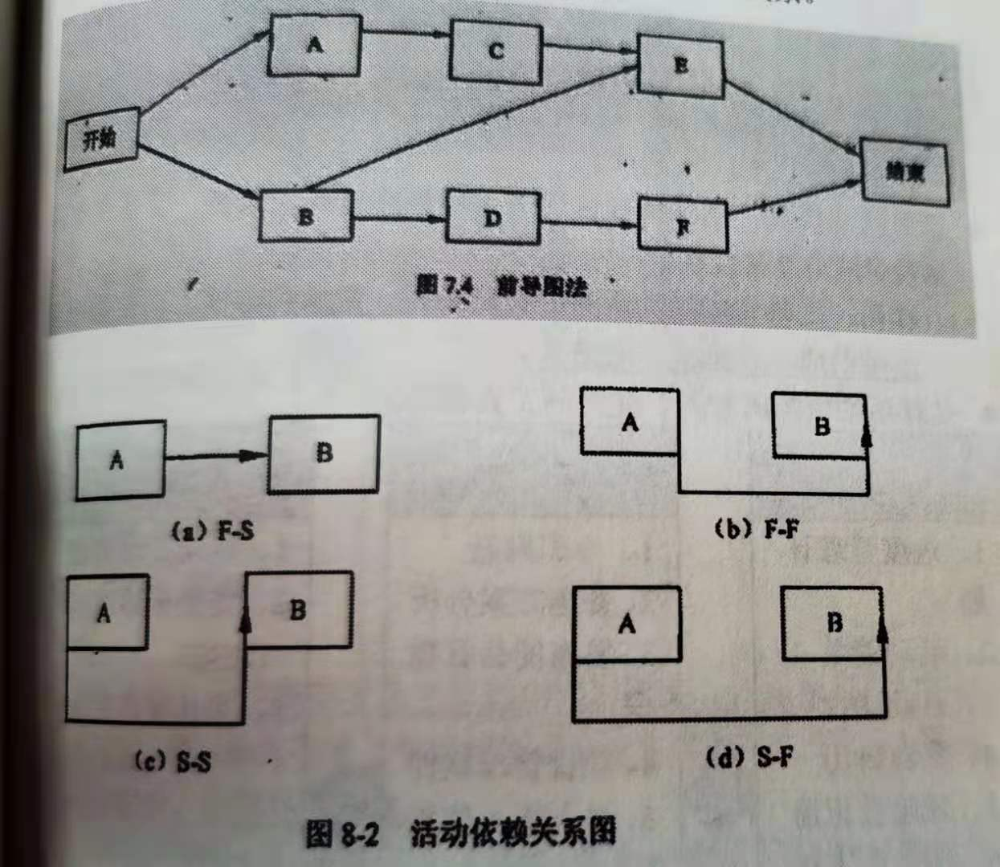
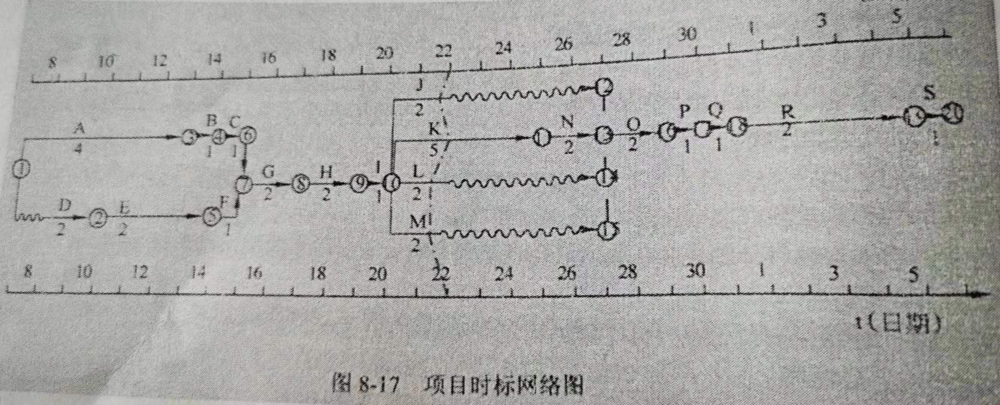

# 项目进度管理

## 一、项目进度管理的各过程（☆）

|     管理过程     | 所属过程组 |                             解释                             |
| :--------------: | :--------: | :----------------------------------------------------------: |
|   规划进度管理   | 计划过程组 | 为计划、编制、管理、执行和控制项目 进度而制定政策、程序和文档过程。 |
|     定义活动     | 计划过程组 | 识别和记录为完成项目可交付成果 而需采取的具体的行动的过程。 |
|   排列活动顺序   | 计划过程组 |             识别和记录项目活动之间的关系的过程。             |
|   估算活动资源   | 计划过程组 | 估算执行各项活动所需材料、人员、设备 或用品的种类和数量的过程。 |
| 估算活动持续时间 | 计划过程组 |  根据资源估算的结果，估算完成单项活动 所需工期的过程。   |
|   制定进度计划   | 计划过程组 | 分析活动顺序、持续时间、资源需求和 进度制约因素，创建项目进度模型的过程。 |
|     控制进度     | 监控过程组 | 监督项目活动状态、更新项目进展、管理 进度基准变更，以实现计划的过程。 |

## 二、规划项目进度管理

为实施项目进度管理制定政策、程序，并形成文档化的项目进度管理计划的过程。进度管理计划可以是正式或非正式的，非常详细或高度概括的。

### 1）、作用：

如何在整个项目过程中管理、执行和控制项目进度提供指南和方向。

### 2）、规划项目进度管理的输入、工具和输出

|      输入       | 工具与技术  |        输出         |
| :-------------: | :---------: | :-----------------: |
| 1、项目管理计划 | 1、专家判断 | 1、项目进度管理计划 |
|   2、项目章程   | 2、分析技术 |                     |
| 3、组织过程资产 |   3、会议   |                     |
| 4、事业环境因素 |             |                     |

### 3）、进度管理计划的内容

项目进度模型制定、准确度、计量单位、组织程序链接、项目进度模型维护、控制临界值、绩效测量规则、报告格式、过程描述。

## 三、定义活动过程：

识别和记录为完成项目可交付成果而需采取的所有活动。

把WBS的工作包分解为一个个的活动是定义活动过程的基本任务。

### 1）、作用

将工作包分解为活动，作为对项目工作进行估算、进度规划、执行、监督和控制的基础。

### 2）、定义活动的输入、工具和输出

|      输入       |  工具与技术   |     输出      |
| :-------------: | :-----------: | :-----------: |
| 1、进度管理计划 |    1、分解    |  1、活动清单  |
|   2、范围基准   | 2、滚动式规划 |  2、活动属性  |
| 3、组织过程资产 |  3、专家判断  | 3、里程碑清单 |
| 4、事业环境因素 |               |               |

## 四、排列活动顺序过程

识别和记录项目活动之间的关系的过程。

### 1）、作用

定义工作之间的逻辑顺序，以便在既定的所有项目制约因素下获得最高的效率。

### 2）、排列活动顺序的输入、工具和输出

|       输入        |    工具与技术     |       输出        |
| :---------------: | :---------------: | :---------------: |
|  1、进度管理计划  |    1、前导图法    | 1、项目进度网络图 |
|    2、活动清单    |    2、箭线图法    |  2、项目文件更新  |
|    3、活动属性    |  3、确定依赖关系  |                   |
|   4、里程碑清单   | 4、提前量与滞后量 |                   |
|  5、事业环境因素  |                   |                   |
| 6、项目范围说明书 |                   |                   |

### 3）、前导图法（PDM）（单代号网络图AON）（☆）

用于关键路径法（CPM），使用方框或者长方形（节点）代表活动，他们之间用箭头连接，显示他们彼此之间存在的逻辑关系。

### 4)、活动依赖关系图

1. 结束—开始的关系（F-S型）。 前序活动结束后，后续活动才能开始。如只有比赛（紧前活动）结束，颁奖典礼（紧后活动）才能开始。
1. 结束—结束的关系（F-F型）。 前序活动结束后，后续活动才能结束。如只有完成文件的编写（紧前活动），才能完成文件的编辑（紧后活动）。
1. 开始—开始的关系（S-S型）。前序活动开始后，后续活动才能开始。如开始地基浇灌（紧前活动）之后，才能开始混凝土的找平（紧后活动）。
1. 开始—结束的关系（S-F型）。前序活动开始后，后续活动才能结束。如只有第二位保安人员开始值班（紧前活动），第一位保安人员才能结束值班（紧后活动）。

### 5）、箭线图法（ADM）（双代号网络图AOA）

箭线表示活动和其逻辑关系，节点表示事件。给每个事件（而不是每项活动）指定一个唯一的代号。活动的开始（箭尾）事件叫紧前事件，活动的结束（箭头）事件叫紧后事件。

虚活动：不消耗时间，只是代表活动之间的逻辑关系，在网络图中由一个虚箭线表示。

## 五、估算活动资源

估算执行各项活动所需的材料、人员、设备或用品的种类和数量的过程。

### 1）、作用

明确完成活动所需的资源种类、数量和特性，以便做出更准确的成本和持续时间估算。

### 2）、估算活动资源的输入、使用的工具和输出

|      输入       |    工具与技术     |          输出          |
| :-------------: | :---------------: | :--------------------: |
| 1、进度管理计划 |    1、专家判断    |    1、活动资源需求     |
|   2、活动清单   |  2、备选方案分析  | 2、资源分解结构（RBS） |
|   3、活动属性   | 3、发布的估算数据 |    3、项目文件更新     |
|   4、资源日历   |  4、项目管理软件  |                        |
|  5、风险登记册  |  5、自上而下估算  |                        |
| 6、活动成本估算 |                   |                        |
| 7、事业环境因素 |                   |                        |
| 8、组织过程资产 |                   |                        |

## 六、估算活动持续时间

根据资源估算的结果，估算完成单项活动所需工作时段数的过程。

### 1）、作用，

确定完成每个活动所需花费的时间量，为制定进度计划过程提供主要输入。

### 2）、估算活动持续时间的输入、使用的工具和输出

|        输入        |   工具与技术    |        输出         |
| :----------------: | :-------------: | :-----------------: |
|  1、进度管理计划   |   1、专家判断   | 1、活动持续时间估算 |
|    2、活动清单     |   2、类比估算   |   2、项目文件更新   |
|    3、活动属性     |   3、参数估算   |                     |
|    4、资源日历     |   4、三点估算   |                     |
|   5、风险登记册    | 5、群体决策技术 |                     |
|  6、活动资源需求   |   6、储备分析   |                     |
|  7、事业环境因素   |                 |                     |
|  8、组织过程资产   |                 |                     |
|  9、资源分解结构   |                 |                     |
| 10、项目范围说明书 |                 |                     |

### 3）、类比估算

一种基于历史数据和项目参数，使用某种算法来计算成本或持续时间的估算技术。参数估算是指利用历史数据之间的统计关系和其他变量（如建筑施工中的平方英尺），来估算诸如成本、预算和持续时间等活动参数。用欲完成工作的数量×生产率可作为估算活动持续时间的量化依据。

最简单的参数估算，就是一元一次方程，即把需要实施的工作量×完成单位工作量所需的工时。如：如果所用的资源每小时能够铺设25米电缆，那么铺设1000米电缆的持续时间是40小时。

### 4）、计划评审技术PERT（三点估算）

期望工期（三点估算法）= （乐观时间 +  4 * 最可能时间 + 悲观时间）

标准差 = （悲观时间- 乐观时间） / 6

方差 = 标准差的平方

标准正态分布应记住的：

活动工期落在1个标准差范围内的概率为68.26%

活动工期落在2个标准差范围内的概率为95.5%

活动工期落在3个标准差范围内的概率为99.7%

在期望工期这个时间点完成的的概率为50%

### 5）、群体决策技术

如头脑风暴、德尔菲技术或名义小组技术。

### 6）、储备分析

是在时间估算的基础上考虑一些时间储备和富裕量。也可称为“应急时间”、“时间储备”、“缓冲时间"。

|                           应急储备                           |                           管理储备                           |
| :----------------------------------------------------------: | :----------------------------------------------------------: |
| 应急储备是未规划，但可能发生的变更提供的补贴，这些变更由风险登记册中所列的已知风险引起。 |   管理储备则是为未规划的范围，变更与成本变更而预留的预算。   |
|                  1、应急储备有PM负责管理。                   | 1、管理储备是为预先考虑的那些”未知的未知风险“做准备的储备。  |
|                    2、PM可支配应急储备。                     |            2、管理储备由发起人或管理层负责管理。             |
|   3、应急储备是为将来应对的”已知的未知风险“做准备的储备。    |        3、PM使用管理储备，需要向发起人或管理层申请。         |
|   4、应急储备是成本绩效基准的一部分，同时也属于项目预算。    |               4、管理储备是项目预算的一部分。                |
|                  5、应急储备纳入挣值计算。                   |              5、管理储备不是成本基准的一部分。               |
| 6、若无计算依据，应急储备可按总成本的一定比例（例如10%）计算，比例可以根据情况确定。 |                 6、管理储备不纳入挣值计算。                  |
|                                                              |               7、管理储备在项目的结束点反映。                |
|                                                              | 8、管理储备的多少取决于管理层对风险的判断，若无估算依据，管理储备可按总成本的一定比例（例如10%）计算，比例可以根据情况确定。 |

## 七、制定进度计划

分析活动顺序、持续时间、资源需求和进度制约因素，创建项目进度模型的过程。是一个反复进行的过程，经批准的最终进度计划将作为基准用于控制进度过程。

### 1）、作用

是把活动、持续时间、资源、资源可用性和逻辑关系代入进度规划工具，从而形成包含各个项目活动的计划日期的进度模型。

### 2）、制定进度计划的输入、使用的工具和输出

|        输入         |     工具与技术      |        输出         |
| :-----------------: | :-----------------: | :-----------------: |
|   1、进度管理计划   |   1、进度网络分析   |     1、进度基准     |
|     2、活动清单     |    2、关键路线法    |   2、项目进度计划   |
|     3、活动属性     |     3、关键链法     |     3、进度数据     |
|  4、项目进度网络图  |     4、建模技术     |     4、项目日历     |
|     5、资源日历     |  5、提前量和滞后量  | 5、项目管理计划更新 |
|   6、活动资源需求   |     6、进度压缩     |   6、项目文件更新   |
| 7、活动持续时间估算 |   7、资源优化技术   |                     |
|  8、项目范围说明书  | 8、进度计划编织工具 |                     |
|    9、风险登记册    |                     |                     |
|  10、项目人员分派   |                     |                     |
|  11、资源分解结构   |                     |                     |
|  12、事业环境因素   |                     |                     |
|  13、组织过程资产   |                     |                     |

### 3）、关键路径

项目网络图中，决定项目最早完成日期的路径，最长的那条路径为关键路径。

### 4）、关键路线法

在进度模型中，估算项目最短工期，确定逻辑网络路径的进度灵活性大小的一种方法。

**总浮动时间（总时差）**：在不延误项目完工时间且不违反进度制约因素的前提下，活动可以从最早开始时间推迟或拖延的时间量。

**自由浮动时间（自由时差）**：在不延误任何紧后活动的最早开始时间且不违反进度制约因素的前提下，活动可以从最早开始时间推迟或拖延的时间量。

**关键链法**： 

进度网络分析技术，可以根据有限的资源对项目进度计划进行调整，是一种结合了确定性与随机性的一种方法。

关键链法引入了缓冲和缓冲管理的概。放置在关键链末端的缓冲称为项目缓冲，用来保证项目不因关键链的延误而延误。其他缓冲，即接驳缓冲则放置在非关键链与关键链的结合点，用来保护关键链不收非关键链延误的影响。

关键链法不再管理网络路径的总浮动时间，而是重点管理剩余的缓冲持续时间与剩余的活动链持续时间之间的匹配关系。

### 5）、进度压缩

在不改变项目范围、进度制约的前提下缩短项目的进度时间。

技术：赶工、快速跟进、加班。

### 6）、建模技术，如假设情景分析

假设情景分析就是对”某一情景出现时应当如何处理“这样的问题进行分析。目的还是使实际进度和计划保持一致。

技术：蒙特卡罗分析。

### 7）、资源优化技术，如资源平衡、资源平滑

**资源平衡**： 为了在资源需求与资源供给之间取得平衡，根据资源制约对开始日期和结束日期进行调整的一种技术。资源平衡使资源利用更合理，会改变原来的关键路线，会导致进度计划延长。

**资源平滑**： 对进度模型中的活动进行调整，从而使项目资源需求不超过预定的资源限制的一种技术。不会改变关键路径，完工日期也不会延迟。

### 8）、提前量和滞后量（☆）

**超前**是指逻辑关系中允许后继活动提前的时间量。

**滞后**是指逻辑关系中表示后继活动需推迟的时间量。

### 9）、进度基准（☆）

被批准的进度计划就是项目或的进度基准。

## 八、控制进度

监督项目活动状态，更新项目进展，管理进度基准变更，以实现计划的过程。

**作用**：是提供发现计划偏离的方法，从而可以及时采取纠正和预防措施，以降低风险。

### 1）、控制进度关注的主要内容

1. 判断项目进度的当前状态；
2. 对引起进度变更的因素施加影响，以保证这种变化朝着有利的方向发展；
3. 判断项目进度是否已经发生变更；
4. 当变更实际发生时，严格按照变更控制流程对其进行管理，

对项目进度的控制，应重点关注项目进展报告和执行状态报告。

### 2）、缩短工期的方法

1. 赶工，投入更多的资源或增加工作时间，以缩短关键活动的工期；赶工的例子包括：批准加班、增加额外资源或支付加急费用，来加快关键路径上的活动。赶工只适用于哪些通过增加资源就能缩短持续时间的，且位于关键路径上的活动。赶工并非总是切实可行，它可能导致风险或成本的增加。
2. 快速跟进，并行施工，以缩短关键路径的长度；
3. 使用高素质的资源或经验更丰富的人员；
4. 减少活动范围或降低活动要求；
5. 改进方法或技术，以提高生产效率；
6. 加强资源管理，及时发现问题，减少返工，从而缩短工期。

### 3）、控制进度的输入、工具和输出

|      输入       |     工具与技术      |        输出         |
| :-------------: | :-----------------: | :-----------------: |
| 1、项目管理计划 |     1、绩效审查     |   1、工作绩效信息   |
| 2、项目进度计划 |   2、项目管理软件   |     2、进度预测     |
| 3、工作绩效数据 |   3、资源优化技术   |     3、变更请求     |
|   4、项目日历   |     4、建模技术     | 4、项目管理计划更新 |
|   5、进度数据   |  5、提前量和滞后量  |   5、项目文件更新   |
| 6、组织过程资产 |     6、进度压缩     | 6、组织过程资产更新 |
|                 | 7、进度计划编制工具 |                     |

### 4）、时标网络图

时标网络图水平坐标表示工作时间，以实箭线表示项目活动，实箭线的水平投影长度表示该活动的持续时间；以虚箭线表示虚活动，由于虚活动的持续时间为零，故虚箭线职能垂直画；以波形线表示活动与其紧后活动之间的自由浮动时间。