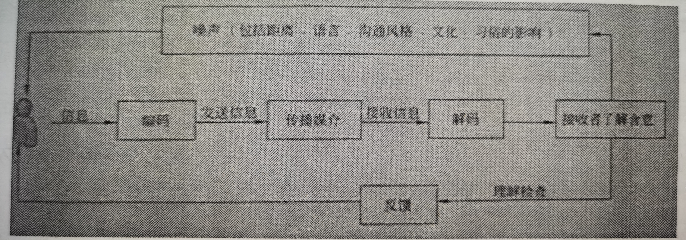

# 项目沟通管理和干系人管理

## 一、沟通模型

编码、信息和反馈信息、媒介、噪音、解码

基本沟通模型包含5个基本状态：已发送、已收到、已理解、已认可、已转化为积极的行动。

## 二、沟通的方式

参与讨论方式（参与度最高）、征询方式、推销方式（说明）、叙述方式（控制度最高）。

## 三、沟通方式的选择

”叙述方式“或”推销方式“：在发送方自认为已经掌握了足够的信息，有了自己的想法且不需要进一步听取多方意见时。

”讨论方式”或“征询方式”:自己掌握信息有限，没有完整成型的意见，需要更多的听取意见时。

在发送自认为掌握了足够的信息，有了自己的想法且不需要进一步听取多方意见时，往往选择控制力机枪、参与程度最弱的“叙述方式”；

其次选择“推销方式”；

而当自己掌握信息有限，没有完整成型的一键，需要更多的听取意见时，一般选择“讨论方式”或者“征询方式”。

## 四、项目沟通管理的过程

|   管理过程   | 所属过程组 |                             解释                             |
| :----------: | :--------: | :----------------------------------------------------------: |
| 规划沟通管理 | 计划过程组 | 根据干系人的信息需要和要求及组织的 可用资产情况，制订合适的项目 沟通方式和计划的过程。 |
|   管理沟通   | 执行过程组 | 根据沟通管理计划，生成、手机、分发、 储存、检索及最终处置项目信息的过程。 |
|   控制沟通   | 监控过程组 | 在整个项目生命周期中对沟通进行监督 和控制的过程，以确保满足项目 干系人对信息的需求。 |

进行沟通过程管理的最终目标是保障干系人之间有效的沟通。有效地沟通包括效果和效率两方面的内容

## 五、规划沟通管理过程

根据干系人的信息需要和要求及组织的可用资产情况，制订合适的项目沟通方式和计划的过程。

### 1）、作用

识别和记录与干系人的最有效率且最有效果的沟通方式。

### 2）、规划沟通管理过程的步骤

1. 确定干系人的沟通信息需求。
2. 描述信息收集和文件归档的结构。
3. 发送信息的格式。

### 3）、规划沟通管理过程的输入、工具和输出

|      输入       |      工具与技术       |        输出         |
| :-------------: | :-------------------: | :-----------------: |
| 1、项目管理计划 |    1、分析沟通需求    | 1、项目沟通管理计划 |
| 2、干系人登记册 | 2、信息传递方式的选择 |   2、项目文件更新   |
| 3、事业环境因素 |                       |                     |
| 4、组织过程资产 |                       |                     |

### 4）、干系人登记册的内容

主要沟通对象（主要干系人）、关键影响人、次要沟通对象（次要干系人）。

### 5）、沟通渠道

n(n-1)/2,n表示干系人数量。

### 6）、沟通管理计划

沟通管理计划提供了项目干系人的需求和期望以及用于沟通的信息，包括格式、内容、细节水平。一个公司的各个项目应该基本采取统一格式记录信息以及进行传递。对于不同层次的项目干系人，应规定不同的信息格式。信息也是层层分解的。根据项目需要可以是正式的也可以是非正式的，非常详细的或粗略的框架式的。

### 7）、沟通管理计划的内容

- 通用术语表。
- 干系人的沟通需求。
- 需要沟通的信息，包括语言、格式、内容、详细程度。
- 发布信息的原因。
- 发布信息及告知收悉或作出回应（如适用）的时限和频率。
- 负责沟通相关信息的人员。
- 负责授权保密信息发布的人员。
- 将要接受信息的个人或小组。
- 传递信息的技术或方法。
- 为沟通活动分配的资源，包括时间和预算。
- 问题升级程序，用于规定下层员工无法解决问题时的上报时限和上报路径。
- 随项目进展，对沟通管理计划进行更新与优化的方法。
- 项目信息流向图、工作流程（兼有授权顺序）、报告清单、会议计划等。
- 沟通制约因素、通常来自特定的法律法规、技术要求和组织政策等。

沟通管理计划中还可包括关于项目状态会议、项目团队会议、网络会议和电子邮件信息等的指南和模板。沟通管理计划中也应包含对项目所用网站和项目管理软件的使用说明。

## 六、管理沟通过程

管理沟通是根据沟通管理计划，生成、收集、分发、储存、检索及最终处置项目信息的过程。

### 1）、作用

促进项目干系人之间实现有效率且有效果的沟通。

### 2）、管理沟通过程的输入、工具和输出

|        输入         |      工具与技术       |        输出         |
| :-----------------: | :-------------------: | :-----------------: |
| 1、项目沟通管理计划 |   1、沟通渠道的选择   |     1、项目沟通     |
|   2、工作绩效报告   | 2、信息传递方式的选择 | 2、项目管理计划更新 |
|   3、事业环境因素   |    3、信息管理系统    |   3、项目文件更新   |
|   4、组织过程资产   |      4、绩效报告      | 4、组织过程资产更新 |

## 七、控制沟通过程

在整个项目生命周期中对沟通进行监督和控制的过程，以确保满足项目干系人对信息的需求

### 1）、作用

随时确保所有沟通参与者之间的信息流动的最优化。

### 2）、控制沟通过程的输入、工具和输出

|      输入       |   工具与技术    |        输出         |
| :-------------: | :-------------: | :-----------------: |
| 1、项目管理计划 | 1、信息管理系统 |   1、工作绩效信息   |
|   2、项目沟通   |   2、专家判断   |     2、变更请求     |
|   3、问题日志   |     3、会议     | 3、项目管理计划更新 |
| 4、工作绩效数据 |                 |   4、项目文件更新   |
| 5、组织过程资产 |                 | 5、组织过程资产更新 |