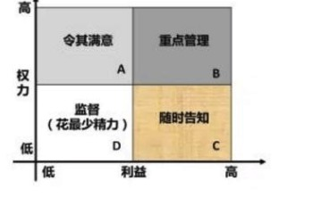
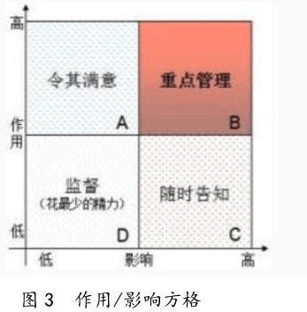

# 项目干系人管理

## 一、项目沟通管理和项目干系人管理的联系和区别

**项目沟通管理**：强调对项目信息的计划、手机、存储、组织、发布，以及监控沟通以保证它的高效性。

**项目干系人管理**：强调的不仅是要管理干系人的期望，更要保证他们的适度参与，而后者是项目成功非常关键的因素之一。

## 二、项目干系人管理

项目尽力负责项目干系人管理，项目干系人管理并不是领导项目的干系人，而是对项目干系人的需要、希望和期望的识别，并通过沟通上的管理来满足其需要、与干系人一起解决问题的多个过程。项目干系人管理就是对项目的沟通进行管理，以满足信息需要者的需求并解决项目干系人之间的问题。主要目标是促进干系人对项目的理解与支持，使干系人了解项目的进展和有可能带来的影响。避免项目干系人在项目管理中出现严重分歧。面对面的会议时最有效的沟通和解决干系人之间问题的方法。

### 1）、项目干系人管理能够带来以下好处

1. 将会赢得更多的资源；
2. 快速频繁的沟通将能确保对项目干系人需要、希望和期望的完全理解。
3. 能够预测项目干系人对项目的影响。

### 2）、项目干系人管理的主要内容

1. 项目干系人分析；
2. 沟通管理；
3. 问题管理；

### 3）、项目干系人的管理依据

1. 项目管理计划；
2. 沟通管理计划；
3. 组织过程资产。

### 4）、项目干系人管理的过程

|    管理过程    | 所属过程组 |                             解释                             |
| :------------: | :--------: | :----------------------------------------------------------: |
|   识别干系人   | 启动过程组 |                     找出所有的项目干系人                     |
| 规划干系人管理 | 计划过程组 | 依据项目跟干系人之间相互影响的大小、 项目干系人的需要，确定干系人管理的思路， 确定对项目干系人进行沟通的措施， 并制定信息沟通登记。 |
|   管理干系人   | 执行过程组 |   与项目的干系人维持不断地沟通， 解决他们之间的问题。   |
| 控制干系人参与 | 监控过程组 | 根据需要定期地或者及时地监控 干系人之间的关系，观察计划和实际之间 的偏差，管理干系人之间的冲突。 |

### 5）、典型干系人

客户、用户、高层领导、项目团队、社会人员、其他（如明确的支持者或隐含的支持者或反对者）。

## 三、识别干系人过程

识别能影响项目决策、活动或结果的个人、群体或组织，以及被项目决策、活动或结果影响的个人、群体或者组织，并分析和记录他们的相关信息的过程。

### 1）、识别干系人过程的输入、工具和输出

|      输入       |   工具与技术    |      输出       |
| :-------------: | :-------------: | :-------------: |
|   1、项目章程   | 1、组织相关会议 | 1、干系人登记册 |
|   2、采购文件   |   2、专家判断   |                 |
| 3、事业环境因素 |  3、干系人分析  |                 |
| 4、组织过程资产 |                 |                 |

### 2）、干系人分析

系统地收集和分析各种定量与定性信息，以便确定每类干系人在整个项目中有哪些力？有哪些要求？有哪些影响？受到哪些影响？······还要了解干系人之间的关系，干系人分析贯穿项目的始终。

### 3）、干系人分析步骤

1. 识别干系人及其信息。
2. 对干系人分类。
   1. **干系人分类方法**：权力/利益方格；权力/影响方格；影响/作用方格；凸显模型。
      1. **权力/利益方格**：根据干系人权力大小、以及利益对其分类。
      2. **权力/影响方格**：干系人权力大小和主动参与（影响）项目的程度分类。
      3. **影响/作用方格**：干系人主动参与项目的程度及改变项目计划或执行的能力进行分组。
      4. **凸显模型**：干系人权力、紧迫程度和合法性对干系人分类。
3. 评估关键干系人的诉求和影响力。

## 四、规划干系人管理管理

### 1）、规划干系人管理过程的输入、工具和输出（☆）

|      输入       |   工具与技术    |       输出        |
| :-------------: | :-------------: | :---------------: |
| 1、项目管理计划 | 1、组织相关会议 | 1、干系人管理计划 |
| 2、干系人登记册 |   2、专辑判断   |  2、项目文件更新  |
| 3、事业环境因素 |   3、分析技术   |                   |
| 4、组织过程资产 |                 |                   |

### 2）、分析技术

可以使用”干系人参与评估矩阵“这个工具记录干系人的当前参与程度。

### 3）、干系人管理计划的内容

1. 关键干系人的所需参与程度和当前参与程度；
2. 干系人变更的范围和影响；
3. 干系人之间的相互关系和潜在交叉；
4. 项目现阶段的干系人沟通需求；
5. 需要分发给干系人的信息，包括语言、格式、内容、详细程度和发送频率；
6. 分发相关信息的理由，以及可能对干系人参与所产生的影响；
7. 随着项目的进展，更新和优化干系人管理计划的方法。

## 五、控制沟通过程

### 2）、控制沟通过程的输入、工具和输出

|      输入       |   工具与技术    |        输出         |
| :-------------: | :-------------: | :-----------------: |
| 1、项目管理计划 | 1、信息管理系统 |   1、工作绩效信息   |
|   2、项目沟通   |   2、专家判断   |     2、变更请求     |
|   3、问题日志   |     3、会议     | 3、项目管理计划更新 |
| 4、工作绩效数据 |                 |   4、项目文件更新   |
| 5、组织过程资产 |                 | 5、组织过程资产更新 |

## 六、管理干系人过程

### 1）、作用

帮助项目经理提升来自干系人的支持、并把反对者的地址降到最低，从而显著提高项目成功的机会。

### 2）、管理干系人过程的输入、工具和输出

|       输入        |   工具与技术    |        输出         |
| :---------------: | :-------------: | :-----------------: |
| 1、干系人管理计划 |   1、沟通方法   |     1、问题日志     |
|  2、沟通管理计划  | 2、人际关系技能 |     2、变更请求     |
|    3、变更日志    |   3、管理技能   | 3、项目管理计划更新 |
|  4、组织过程资产  |                 |   4、项目文件更新   |
|                   |                 | 5、组织过程资产更新 |

### 3）、常用的沟通方式

#### （1）、交互式沟通。

在两方或多方之间进行多向信息交换。这是确保全体参与者对特定话题达成共识的最有效的方法，包括会议、电话、即时通信、视频会议等。

#### （2）、推式沟通。

把信息发送给需要接收这些信息的特定接收方，推式沟通包括信件、备忘录、报告、电子邮件、传真、语音邮件、日志、新闻稿等。

#### （3）、拉式沟通。

用于信息量很大或受众很多的情况。要求接受者自主自行地访问信息内容。这种方法包括企业内网、电子在线课程、经验教训数据库、知识库等。

## 七、控制干系人参与过程

全面监督项目干系人之间的关系，调整策略和计划，以调动干系人参与的过程。

### 1)、作用

随着项目进展和环境变化，维持并提升干系人参与活动的效率和效果。

### 2）控制干系人参与过程的输入、工具和输出

|      输入       |   工具与技术    |        输出         |
| :-------------: | :-------------: | :-----------------: |
| 1、项目管理计划 | 1、信息管理系统 |   1、工作绩效信息   |
|   2、问题日志   |   2、专家判断   |     2、变更请求     |
| 3、工作绩效数据 |     3、会议     | 3、项目管理计划更新 |
|   4、项目文件   |                 |   4、项目文件更新   |
|                 |                 | 5、组织过程资产更新 |